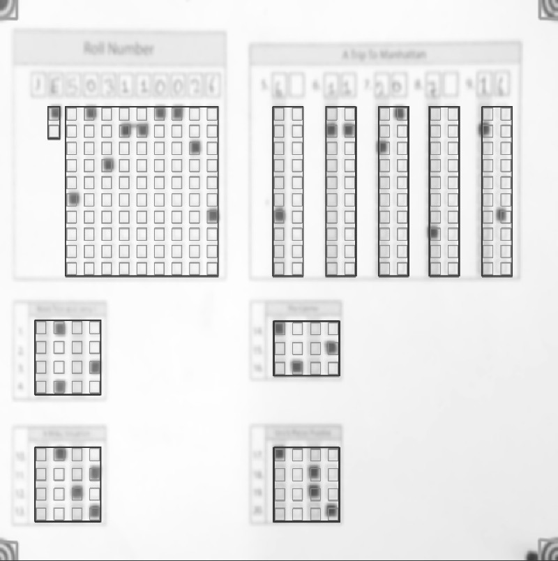

## Meaning of parameters used in the template.json file

Let's take an example of sample1 from the [samples](https://github.com/Udayraj123/OMRChecker/tree/master/samples). 

You may use below commands from project root to load the sample template.
```bash
# Note: you may remove previous inputs (if any) with `mv inputs/* ~/.trash` 
cp -r ./samples/sample1 inputs/
python3 main.py --setLayout
```
Which shows the template overlay like below -
<p align="center">
  
</p>


Let's examine the template.json used in this sample.
```js
{   
  // The dimensions to which each input image will be resized to before processing
  "Dimensions": [
    1846,
    1500
  ],
  // The dimensions of the overlay bubble area
  "BubbleDimensions": [
    40,
    40
  ],
  // Custom configuration values to use in the template's directory
  "Options": {
    "Marker": {
        // path to marker file
      "RelativePath": "omr_marker.jpg",
        // a factor by which marker shall be resized relative to input image 
      "SheetToMarkerWidthRatio": 17
    }
  },
  
// The Contatenations parameter is a way to tell OMRChecker which fields need to be joined together before outputting into the csv.
  "Concatenations": {
    // For example, the "Roll" key corresponds to a single column in the output csv, which would be generated by concatenating the fields Squad, Medium, roll0, roll1, etc. Note: all these keys need to be present in one of the QBlocks.
    "Roll": [
      "Squad",
      "Medium",
      "roll0",
      "roll1",
      "roll2",
      "roll3",
      "roll4",
      "roll5",
      "roll6",
      "roll7",
      "roll8"
    ],
    // This is another use case of Concatenations - for two-digit integer type questions. Concatenating the two columns in the template("q5.1" and "q5.2") eases the answer checking in the csv.
    "q5": [
      "q5.1",
      "q5.2"
    ],
    // ...
  },
  // All the remaining fields(in order) whose readings shall be forwarded directly in the output csv
  "Singles": [
    "q1",
    "q2",
    "q3",
    // ...
  ],
  // Each rectangular box you see in the template overlay image is an element of QBlock 
  // QBlock is either a rectangular box, or a grid of such boxes.
  "QBlocks": {
      // name of the QBlock
      "Medium": {
        // qTypes are currently defined in template.py in the map qtype_data
        "qType": "QTYPE_MED",
        // the top left starting point of QBlock
        "orig": [
          160,
          285
        ],
        // (bigGapX, bigGapY) are the gaps between origins of each box
        "bigGaps": [
          115,
          11
        ],
        // (gapX,gapY) are the gaps between rows and cols in a box i.e. gaps between the bubbles
        "gaps": [
          59,
          46
        ],
        // qNos(nested array) defines the arrangement of questions in this QBlock (see more samples for a better idea)
        "qNos": [
          [
            [
              "Medium"
            ]
          ]
        ]
    },
    // another QBlock
    "Roll": {
      // QTYPE_ROLL is another predefined type of question. This includes information whether the field is a column or a row in the template(see template.py for more)
      "qType": "QTYPE_ROLL",
      // the top left starting point of Roll QBlock
      "orig": [
        218,
        285
      ],
      "bigGaps": [
        115,
        11
      ],
      "gaps": [
        58,
        46
      ],
      "qNos": [
        [
          [
            // each column mentioned below will have a distance of 'gapX' between them, and a vertical distance of 'gapY' between each bubbles
            "roll0",
            "roll1",
            "roll2",
            "roll3",
            "roll4",
            "roll5",
            "roll6",
            "roll7",
            "roll8"
          ]
        ]
      ]
    },
    // One more example that shows how integer type questions are created.
    "Int1": {
      "qType": "QTYPE_INT",
      "orig": [
        903,
        285
      ],
      "bigGaps": [
        128,
        11
      ],
      "gaps": [
        59,
        46
      ],
      "qNos": [
        [
          [
            "q5.1",
            "q5.2"
          ],
          [
            "q6.1",
            "q6.2"
          ],
          [
            "q7.1",
            "q7.2"
          ]
        ]
      ]
    },
    // ...
    // Another QBlock
    "Mcq1": {
      // Here, QTYPE_MCQ4 describes a row of bubbles
      "qType": "QTYPE_MCQ4",
      "orig": [
        118,
        857
      ],
      // bigGaps will be used to space between the two boxes(q1-q4 and q10-q13) 
      "bigGaps": [
        115,
        181
      ],
      // since this is a row of bubbles, gapX value will be used as the distance between two bubbles, while gapY used as distance between two rows.
      "gaps": [
        59,
        53
      ],
      "qNos": [
        [
          [
            "q1",
            "q2",
            "q3",
            "q4"
          ],
          // values from bigGaps will be used to space between the two boxes(q1-q4 and q10-q13)
          [
            "q10",
            "q11",
            "q12",
            "q13"
          ]
        ]
      ]
    },
    // ...
}
```
