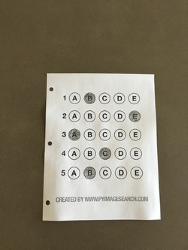
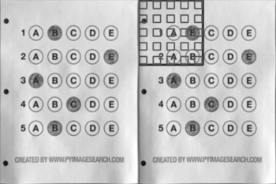
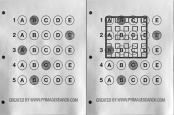
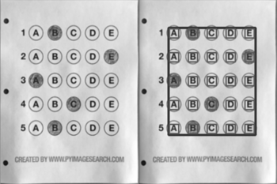

# Step by Step Walkthrough for Creating Template Layout
**Note for contributors:** There's a [TODO Challenge](./TODOs) to automate this process using image processing. 

## Setting up template on a sample image
This tutorial will show you how to create template layout files such as the default 'H_template.json' by two examples.

<!-- TODO explain directory structure here -->

First let's make a layout for a sample OMR from [Adrian's blog](https://pyimagesearch.com/2016/10/03/bubble-sheet-multiple-choice-scanner-and-test-grader-using-omr-python-and-opencv/).
<!-- image here -->
<p align="center">
  
</p>

1. Create a directory for your files, say `inputs/OMR_Files/AdrianSamples`. You can have multiple directories here(in production these can be city names). All of them will be checked by the program(thus you may want to remove unnecessary folders from `inputs/`).

2. Put your image(s) in `inputs/OMR_Files/AdrianSamples/HE`. The *HE* part indicates *H_template.json* will be used(*JE* is also supported to use one more template *J_template.json*).

3. Open `inputs/H_template.json`. 
Start with putting the following text in it.

**Note:** To be able to copy <span></span> below commands directly, use [CodeCopy Chrome](https://chrome.google.com/webstore/detail/codecopy/fkbfebkcoelajmhanocgppanfoojcdmg) | [CodeCopy Firefox](https://addons.mozilla.org/en-US/firefox/addon/codecopy/).

```
{
  "Dimensions": [300, 400 ],
  "BubbleDimensions": [20, 20 ],
  "Concatenations" : {},
  
  "Singles" : ["q1","q2","q3","q4","q5"],
  "MCQBlock1": {
    "qType": "QTYPE_MCQ5",
    "orig": [0, 0],
    "qNos": [
      [
        ["q1", "q2", "q3", "q4", "q5"]
      ]
    ],  
    "gaps" : [30, 30 ],
    "bigGaps" : [30, 30]
  }
}
```

Run `python3 main.py --noMarkers --setLayout`. The page should get cropped automatically.
Note that we have put `"orig": [0, 0],` which means the overlay will start from the top left corner.
<!-- Put initial layout here -->
<p align="center">
  
</p>
Now adjust the top left corner(origin). After checking output on multiple runs, you should find that origin is best fit at [65, 60]. Update the origin in json file : 

```
    "orig": [65, 60],
```
Run the command again.
<!-- Put origin_step here -->
<p align="center">
  
</p>

Now let's tweak over `gaps`. The following diagram explains the concept of gaps. 
Clearly we need to update the gaps to be bigger. Also, horizontal gaps are smaller than vertical ones. Tweaked gaps come out to be- 
```
    "gaps" : [41, 52],
```
The bubbles also should be made slightly bigger
```
  "BubbleDimensions": [25, 25 ],
```
Run the command again to get the arranged layout.
<!-- put final_layout here -->
<p align="center">
  
</p>

Layout configuration for above arrangement is:
```
{
  "Dimensions": [300, 400 ],
  "BubbleDimensions": [25, 25],
  "Concatenations" : {},
  
  "Singles" : ["q1","q2","q3","q4","q5"],
  "MCQBlock1": {
    "qType": "QTYPE_MCQ5",
    "orig": [65, 60],
    "qNos": [
      [
        ["q1", "q2", "q3", "q4", "q5"]
      ]
    ],  
    "gaps" : [41, 52],
    "bigGaps" : [30, 30]
  }
}
```
Above is the simplest version of what layouts file can do. 

For more templates see `sample*` folders which make use of *bigGaps* parameter as well.
<!-- 
	4. Put marker crop(If any) at `inputs/omr_marker.jpg`. Adjust templ_scale_fac in globals.py 
-->

<!-- bummer: do not change the header text as it's linked -->
## Run the code

`python3 main.py [--noMarkers] [--setLayout] [--noCrop] [--noAlign]` 

Explanation for the arguments:

`--setLayout` : To setup template layout interactively(for custom OMRs). See Walkthrough [here](https://github.com/Udayraj123/OMRChecker/wiki/User-Guide).

`--noMarker` : If the images do not have a marker.

`--noAlign` : If the images are captured without much bending of paper.
<!-- explanatory image here -->
`--noCrop` : If the images are using a document scanner or do not need cropping page boundary.

