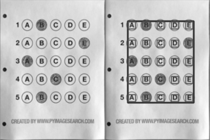

## Step by step walkthrough for creating a basic template
<!-- **Note for contributors:** There's a [TODO Challenge](./TODOs) to automate this process using image processing.  -->

This tutorial will show you how to create template layout files using a simple example.

<!-- TODO explain directory structure here -->

First let's make a layout for a sample OMR from [Adrian's blog](https://pyimagesearch.com/2016/10/03/bubble-sheet-multiple-choice-scanner-and-test-grader-using-omr-python-and-opencv/).
<!-- image here -->
<p align="center">
  
</p>

1. Create a directory for your files, say `inputs/AdrianSamples`. Note that all directories in `inputs/` directory will be processed by default.

2. Download above OMR image and put it into `inputs/AdrianSamples/`.

3. Create a file `inputs/template.json`. Start with putting the following text in it.

_Note: To be able to copy below snippets directly, consider using [CodeCopy Chrome](https://chrome.google.com/webstore/detail/codecopy/fkbfebkcoelajmhanocgppanfoojcdmg) | [CodeCopy Firefox](https://addons.mozilla.org/en-US/firefox/addon/codecopy/)._

```
{
  "dimensions": [ 300, 400 ],
  "bubbleDimensions": [ 20, 20 ],
  "concatenations": {},
  "singles": [ "q1", "q2", "q3", "q4", "q5" ],
  "qBlocks": {
    "MCQBlock1": {
      "qType": "QTYPE_MCQ5",
      "orig": [ 0, 0 ],
      "qNos": [
        [
          [ "q1", "q2", "q3", "q4", "q5" ]
        ]
      ],
      "gaps": [ 30, 30 ],
      "bigGaps": [ 30, 30 ]
    }
  },
  "preProcessors": [
    {
      "name": "CropPage",
      "options": {
        "morphKernel": [ 10, 10 ]
      }
    }
  ]
}
```

Now run `python3 main.py --setLayout`. The page should get cropped automatically and show a basic overlay of the template.
Note that we have put `"orig": [0, 0],` which means the overlay will start from the top left corner.

<p align="center">
  
</p>
Now let's adjust the top left corner(origin). Change origin from [0,0] to a better coordinate, say [50, 50] and run above command again. After multiple trials, you should find that origin is best fit at [65, 60]. Update the origin in json file : 

```
    "orig": [65, 60],
```
Run the command again.
<!-- Put origin_step here -->
<p align="center">
  
</p>

Now let's tweak over `gaps`. The following diagram explains the concept of gaps. 
Clearly we need to update the gaps to be bigger. Also, horizontal gaps are smaller than vertical ones. Tweaked gaps come out to be- 
```
    "gaps" : [41, 52],
```
The bubbles also should be made slightly bigger
```
  "bubbleDimensions": [25, 25 ],
```
Run the command again to get the arranged layout.
<!-- put final_layout here -->
<p align="center">
  
</p>

Note the "preProcessors" array, there are various plugins to use. Each plugin is described with a `name` and an `options` object that contains the configuration of the plugin. In our case, we use the 'CropPage' plugin with a (default) option of using morph kernel of size [10, 10].

Above is the simplest version of what the template.json can do. 

For more templates see [sample folders](https://github.com/Udayraj123/OMRChecker/tree/master/samples) which make use of *bigGaps* parameter as well.

To understand how rest of the parameters work in template.json, checkout [About Templates](./About-Templates)

### Note for capturing using mobile phones

Please check the `sample1/` folder to understand the use of `omr_marker.jpg`. If you can modify your OMR sheets with these markers, it will give you much higher accuracy when scanning using mobile camera.

<!-- 
	1. Put marker crop(If any) at `inputs/omr_marker.jpg`. Adjust SheetToMarkerWidthRatio in globals.py 
-->

<!-- bummer: do not change the header text as it's linked -->
## Running OMRChecker
```
python3 main.py [--setLayout] [--autoAlign] [--inputDir dir1] [--outputDir dir1]
```
Explanation for the arguments:

`--autoAlign`: (experimental) Enables automatic template alignment - use if the scans show slight misalignments.

`--setLayout`: Set up OMR template layout - modify your json file and run again until the template is set.

<!-- `--noCropping`: Disables page contour detection - used when page boundary is not visible e.g. document scanner or a close up capture. -->

`--inputDir`: Specify an input directory.

`--outputDir`: Specify an output directory.

<!-- `--template`: Specify a default template if no template file in input directories. -->

**Note:** The `--noCropping` flag has been replaced with including/excluding a 'CropPage' plugin in "preProcessors" of the template.json(see [samples](https://github.com/Udayraj123/OMRChecker/tree/master/samples)).

<!-- mention col_orient by example -->