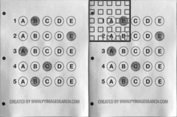

# Step by Step Walkthrough for Creating Template Layout
**Note for contributors:** There's a [TODO Challenge](./TODOs) to automate this process using image processing. 

## Setting up template on a sample image
This tutorial will show you how to create template layout files such as the default 'H_template.json' by two examples.

<!-- TODO explain directory structure here -->

First let's make a layout for a sample OMR from [Adrian's blog](https://pyimagesearch.com/2016/10/03/bubble-sheet-multiple-choice-scanner-and-test-grader-using-omr-python-and-opencv/).
<!-- image here -->
<p align="center">
  
</p>

1. Create a directory for your files, say `inputs/AdrianSamples`. Note that all directories in `inputs/` directory will be processed by default.

2. Download above OMR image and put it into `inputs/AdrianSamples/`.

3. Create a file `inputs/template.json`. Start with putting the following text in it.

**Note:** To be able to copy <span></span> below snippets directly, use [CodeCopy Chrome](https://chrome.google.com/webstore/detail/codecopy/fkbfebkcoelajmhanocgppanfoojcdmg) | [CodeCopy Firefox](https://addons.mozilla.org/en-US/firefox/addon/codecopy/).

```
{
    "Dimensions": [
        300,
        400
    ],
    "BubbleDimensions": [
        20,
        20
    ],
    "Concatenations": {},
    "Singles": [
        "q1",
        "q2",
        "q3",
        "q4",
        "q5"
    ],
    "QBlocks": {
        "MCQBlock1": {
            "qType": "QTYPE_MCQ5",
            "orig": [
                0,
                0
            ],
            "qNos": [
                [
                    [
                        "q1",
                        "q2",
                        "q3",
                        "q4",
                        "q5"
                    ]
                ]
            ],
            "gaps": [
                30,
                30
            ],
            "bigGaps": [
                30,
                30
            ]
        }
    }
}
```

Now run `python3 main.py --setLayout`. The page should get cropped automatically and show a basic overlay of the template.
Note that we have put `"orig": [0, 0],` which means the overlay will start from the top left corner.

<p align="center">
  
</p>
Now let's adjust the top left corner(origin). Change origin from [0,0] to a better coordinate, say [50, 50] and run above command again. After multiple trials, you should find that origin is best fit at [65, 60]. Update the origin in json file : 

```
    "orig": [65, 60],
```
Run the command again.
<!-- Put origin_step here -->
<p align="center">
  
</p>

Now let's tweak over `gaps`. The following diagram explains the concept of gaps. 
Clearly we need to update the gaps to be bigger. Also, horizontal gaps are smaller than vertical ones. Tweaked gaps come out to be- 
```
    "gaps" : [41, 52],
```
The bubbles also should be made slightly bigger
```
  "BubbleDimensions": [25, 25 ],
```
Run the command again to get the arranged layout.
<!-- put final_layout here -->
<p align="center">
  
</p>

Layout configuration for above arrangement is:
```

```
Above is the simplest version of what layouts file can do. 

For more templates see `sample*` folders which make use of *bigGaps* parameter as well.
<!-- 
	4. Put marker crop(If any) at `inputs/omr_marker.jpg`. Adjust SheetToMarkerWidthRatio in globals.py 
-->

<!-- bummer: do not change the header text as it's linked -->
## Run the code
```
python3 main.py [--setLayout] [--noCropping] [--autoAlign] [--inputDir dir1] [--outputDir dir1] [--template path/to/template.json]
```
Explanation for the arguments:

`--setLayout`: Set up OMR template layout - modify your json file and run again until the template is set.

`--autoAlign`: (experimental) Enables automatic template alignment - use if the scans show slight misalignments.

`--noCropping`: Disables page contour detection - used when page boundary is not visible e.g. document scanner.

`--inputDir`: Specify an input directory.

`--outputDir`: Specify an output directory.

`--template`: Specify a default template if no template file in input directories.


<!-- mention col_orient by example -->